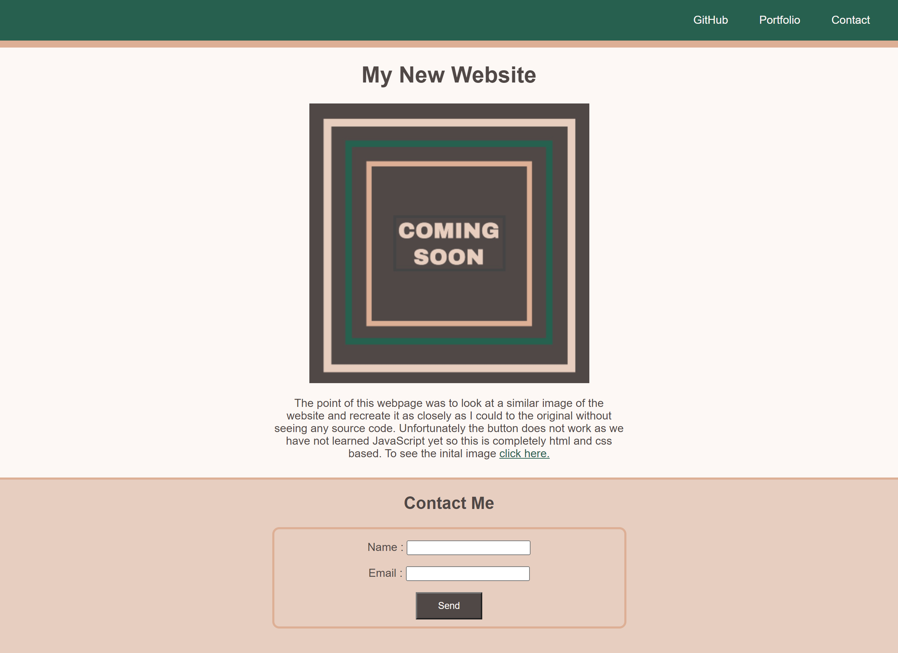

# M1-Landing-Page

## Description

This website was designed in order to practice basic html and css. The challenge was to recreate a website from a screenshot without any prior knowledge of the base code or inspection tool.  
While coding this Portfolio I learned to:

- Center various elements on a webpage
- Add a border around divs that I gave the class of ".card"
- Color select the colors on an image in order to use them in my work
- Write html from scratch without a base framework

The original Acceptance Criteria were as follows

### Acceptance Criteria

```
* It's done when the page uses semantic HTML elements.
* It's done when the page uses universal, element, and class selectors in CSS.
* It's done when the page features at least three colors in the design.
* It's done when the page uses a single font and font family for all text.
* It's done when the page uses at least two heading elements (`<h1>` through `<h6>`).
* It's done when the header is fixed to the top of the page on scroll.
* It's done when the header contains a navigation bar with three links that display inline, including a contact link.
* It's done when, if the contact link is clicked, the page jumps directly to the contact form.
* It's done when the contact form includes `input` elements for name and email.
* It's done when the contact form includes a Send button.
* It's done when the image includes a descriptive `alt` attribute.
* It's done when the page is deployed to GitHub Pages.
```

## Link

Click Here: [Deployed Site](https://mateo-wallace.github.io/M2-Challenge-Portfolio/)

## Screenshot



## Example Image From Assignment


